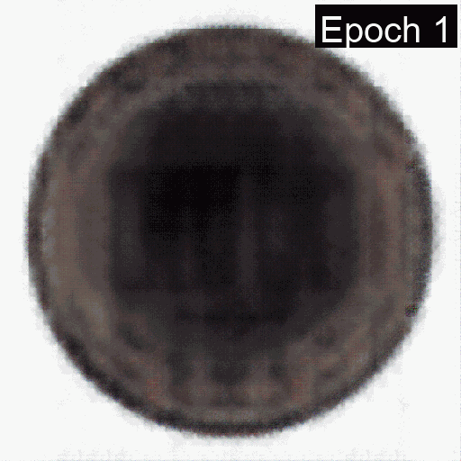

# MvTec-Anomaly-Detection
## Dataset Download
Download the MVTec AD dataset from the following link: 

[MVTec AD Dataset](https://www.kaggle.com/datasets/ipythonx/mvtec-ad)

The official website of the dataset is:

[MVTec Official AD Dataset](https://www.mvtec.com/company/research/datasets/mvtec-ad/)
## Learning of Convolutional Autoencoder
Learning of Convolutional Autoencoder for Anomaly Detection in MVTec AD Dataset up to 100 epochs.
<table>
  <tr>
    <td></td>
    <td></td>
    <td></td>
    <td></td>
  </tr>
  <tr>
    <td></td>
    <td></td>
    <td></td>
    <td></td>
  </tr>
</table>

## Usage
### Training
Input arguments for training are as follows:
```bash
python train.py 
--data-path <path_to_dataset> 
--batch-size <batch_size>
--num-workers <number_of_workers>
--lr <learning_rate>
--epochs <number_of_epochs>
--device <device>
--n-save <num_of_images_per_class_to_save>
--emb-dim <embedding_dimension>
```

Default values used for training on an NVIDIA RTX 3080 are:
```bash
python train.py
--data-path <path_to_dataset>
--batch-size 16
--num-workers 4
--lr 1e-3
--epochs 100
--device cuda
--n-save 5
--emb-dim 1024
```

## Future Work
* More experiments with Convolutional Autoencoder
* Evaluation on detection of anomalies