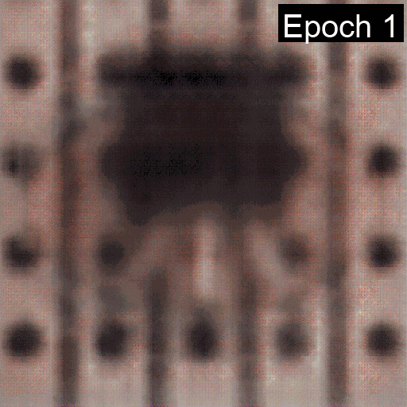
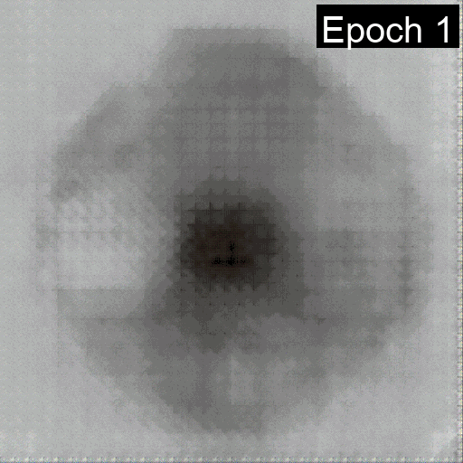

# MvTec-Anomaly-Detection
## Dataset Download
Download the MVTec AD dataset from the following link: 

[MVTec AD Dataset](https://www.kaggle.com/datasets/ipythonx/mvtec-ad)

The official website of the dataset is:

[MVTec Official AD Dataset](https://www.mvtec.com/company/research/datasets/mvtec-ad/)
## Learning of Convolutional Autoencoder
Learning of Convolutional Autoencoder for Anomaly Detection in MVTec AD Dataset up to 100 epochs.
<table>
  <tr>
    <td></td>
    <td></td>
    <td></td>
    <td></td>
  </tr>
  <tr>
    <td></td>
    <td></td>
    <td></td>
    <td></td>
  </tr>
</table>

## Future Work
* More experiments with Convolutional Autoencoder
* Evaluation on detection of anomalies